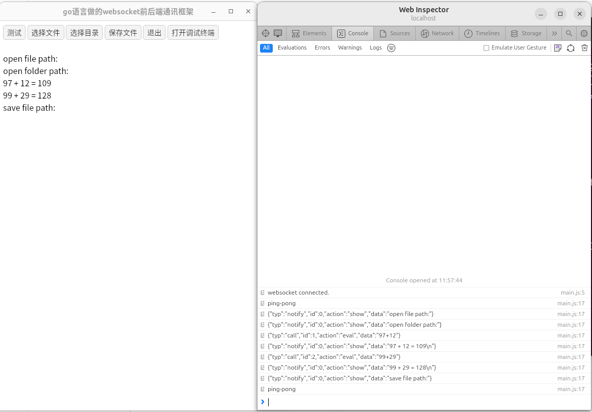

# A front-end and back-end integration framework using the Go language
* Implement a backend server in Go language that integrates WebSocket and static file services.
* The front-end is implemented using GTK4 and WebKitGtk-6.0, with code in ` lib/webkitgtk6 with go ` and package name ` gowebkitgtk6 `.
* When the frontend calls the backend, use 'fetch' to call a regular 'web API'.
* When the backend calls the frontend, use RPC running on WebSocket to make the call.

##Screenshot:


scratch-gui:


##Compilation method:
Taking 'Ubuntu 24.04' as an example:

```
#The first step is to install the compilation environment
sudo apt install build-essential libwebkitgtk-6.0-dev libgtk-4-dev
#Step 2, compile the main program
go mod tidy
go build
```
##Function extension:
* The front-end can use frameworks such as React to create complex interfaces, while the back-end only needs to modify the extension functions by following the code of Static/Main. js when calling the front-end.
* The backend can use 'httpserver. HandleFunc' to add various' APIs'.
* Supports opening local 'file selection dialog box', 'directory selection dialog box', and 'file save dialog box'.